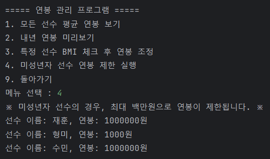

# SPORTS-AGENCY

## :anchor: 팀원

|  |  |
|:------------------------------------------------------------------------------------------:|:-------------------------------------------------------------------------------------------:|
|                      [@KimJaehoon64](https://github.com/KimJaehoon64)                      |                 Park Seolbin [@seolbin01](https://github.com/seolbin01)                 |

 

## :ocean: 프로젝트 소개
> 이 프로젝트는 스포츠 에이전시에서 선수의 정보를 효율적으로 관리하고 수정할 수 있도록 돕기 위해 개발된 Java 기반의 콘솔 프로젝트입니다.

 

## :whale: 주요 기능 설명

### :fish: 메인 메뉴
1. 선수 관리 : 선수의 기본적인 정보 등록, 수정 삭제와 같은 관리 작업에 관련된 기능을 포함합니다.
2. 연봉 관리 : 선수의 성과나 특이점에 따라 연봉을 조정하는 기능을 포함합니다.
3. 건강 관리 : 선수의 부상에 관련된 정보를 관리하는 기능을 포함합니다.
4. 통계 및 분석 : 선수 데이터를 바탕으로 다양한 통계 정보를 제공하는 기능을 포함합니다.

메인 메뉴 이미지

 

### 1️⃣ 선수 관리

1. 모든 선수 정보 보기

2. 선수 찾기

3. 선수 등록

4. 선수 정보 수정

5. 선수 방출

6. 특정 년도에 따른 성인 선수 선별

 

### 2️⃣ 연봉 관리

1. 모든 선수 평균 연봉 보기

2. 내년 연봉 미리보기

3. 특정 선수 BMI 체크 후 연봉 조정

4. 미성년자 선수 연봉 제한 실행

 

### 3️⃣ 건강 관리

1. 사고 발생

2. 부상 치료

3. 부상 유무에 따른 선수 등급 조정

 

### 4️⃣ 통계 및 분석

1. 종목별 최고 등급 선수

2. 종목별 평균 신장

3. MZ세대 선수 중 가장 가벼운 선수 찾기

4. 모든 선수 목록(선수명)

 